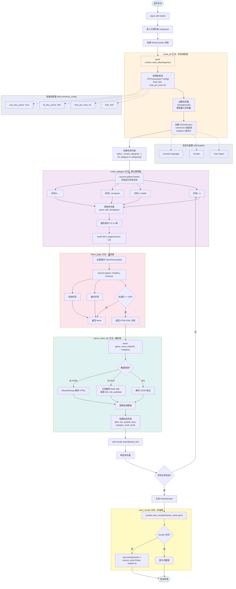

# IT之家新闻爬虫 - 架构流程图与详细解析

## 流程图



---

## 详细流程解析

### 第一阶段：程序初始化

#### 1. 入口函数 `main()`
程序从 `if __name__ == "__main__":` 开始，通过 `asyncio.run(main())` 启动异步事件循环。

**主要工作：**
- 定义要爬取的分类列表（it、mobile、computer 等 8 个分类）
- 创建 `NewsCrawler` 爬虫实例
- 记录开始时间，用于后续统计耗时

#### 2. NewsCrawler 初始化
在 `__init__` 方法中配置爬虫的基础参数：

**连接池配置 `self.connector_config`：**
| 参数 | 值 | 作用 |
|------|-----|------|
| `limit` | 100 | 连接池最大连接数，控制整体并发能力 |
| `limit_per_host` | 10 | 单个域名最大连接数，防止对同一网站请求过频 |
| `ttl_dns_cache` | 300 | DNS 缓存时间（秒），减少域名解析开销 |
| `use_dns_cache` | True | 启用 DNS 缓存，提升请求速度 |

**请求头配置 `self.headers`：**
| 请求头 | 值 | 作用 |
|--------|-----|------|
| `User-Agent` | 浏览器标识 | 伪装成真实浏览器，避免被识别为爬虫 |
| `Accept` | 接受的内容类型 | 告诉服务器客户端能处理的内容格式 |
| `Accept-Language` | zh-CN,zh | 声明语言偏好，获取中文内容 |
| `Accept-Encoding` | gzip, deflate, br | 支持压缩传输，减少带宽 |
| `Connection` | keep-alive | 保持连接，配合连接池复用 |

---

### 第二阶段：并发控制层 `crawl_all()`

这是整个爬虫的**核心调度中心**，负责协调所有并发任务。

#### 1. 创建连接池
```python
connector = aiohttp.TCPConnector(**self.connector_config)
```
- `**` 是字典解包操作符，等价于 `TCPConnector(limit=100, limit_per_host=10, ...)`
- 连接池的作用是**复用 TCP 连接**，避免每次请求都进行三次握手
- 类比：就像餐厅的固定座位，客人走后下一个直接用，不用重新安排

#### 2. 创建信号量
```python
semaphore = asyncio.Semaphore(5)
```
- 信号量控制**最大并发数为 5**
- 即使有 8 个分类任务，同时最多只有 5 个在执行
- 类比：游泳池只有 5 条泳道，同时只能有 5 个人游泳，其他人要排队等待

#### 3. 创建 ClientSession
```python
async with aiohttp.ClientSession(
    connector=connector,
    headers=self.headers
) as session:
```
- `ClientSession` 是 aiohttp 的核心对象，管理所有 HTTP 请求
- 绑定连接池和请求头，后续所有请求都共享这些配置
- `async with` 是异步上下文管理器，确保 Session 在使用完毕后**自动关闭**，释放资源

#### 4. 创建任务列表
```python
tasks = [
    self.crawl_category(session, category, semaphore)
    for category in categories
]
```
- 使用**列表推导式**为每个分类创建一个协程任务
- 每个任务都传入同一个 session、不同的 category、同一个 semaphore
- 此时任务**只是创建，还未执行**

#### 5. 并发执行
```python
await asyncio.gather(*tasks, return_exceptions=True)
```
- `*tasks` 是列表解包，等价于 `gather(task1, task2, task3, ...)`
- `gather` 会**同时启动所有任务**，让它们并发执行
- `return_exceptions=True` 表示即使某个任务报错，也不会中断其他任务
- `await` 会等待所有任务完成后才继续执行（但等待期间会**让出 CPU**，执行其他协程）

---

### 第三阶段：单分类爬取 `crawl_category()`

每个分类任务都会执行这个方法，是**实际干活的地方**。

#### 1. 获取信号量
```python
async with semaphore:
```
- 进入时获取信号量（占用一个并发名额）
- 如果已有 5 个任务在执行，当前任务会**阻塞等待**，直到有任务释放信号量
- 退出时自动释放信号量（释放并发名额）

#### 2. 随机延时
```python
await asyncio.sleep(random.uniform(0.5, 1.5))
```
- 随机等待 0.5~1.5 秒，模拟人类操作节奏
- **防封关键**：避免请求间隔太规律，被服务器识别为机器行为

#### 3. 请求页面
```python
html = await self.fetch_page(session, url)
```
- 调用 `fetch_page` 方法获取页面内容
- `await` 等待请求完成，期间让出 CPU 给其他任务

#### 4. 解析数据
```python
news_list = await self.parse_news_list(html, category)
```
- 调用 `parse_news_list` 解析页面，提取新闻数据
- 返回新闻列表（字典数组）

#### 5. 保存结果
```python
self.results.extend(news_list)
```
- 将解析到的新闻追加到总结果列表中
- `extend` 是列表方法，将多个元素一次性添加

---

### 第四阶段：请求层 `fetch_page()`

负责发起 HTTP 请求，获取页面内容。

#### 1. 设置超时
```python
timeout = aiohttp.ClientTimeout(total=30)
```
- 总超时时间 30 秒，防止请求卡死
- 如果 30 秒内没响应，会抛出 `TimeoutError`

#### 2. 发起请求
```python
async with session.get(url, headers=self.headers, timeout=timeout, ssl=False) as response:
```
- `session.get` 发起 GET 请求
- `ssl=False` 忽略 SSL 证书验证（避免某些网站证书问题导致报错）
- `async with` 确保响应体使用完毕后自动释放

#### 3. 检查状态码
```python
if response.status == 200:
    # 尝试解析 JSON，否则返回文本
    try:
        json_data = await response.json()
        return json_data
    except:
        html = await response.text()
        return html
```
- 状态码 200 表示请求成功
- 先尝试解析为 JSON（API 接口返回），失败则返回文本（HTML/XML）
- 这种设计让爬虫能**同时支持多种数据格式**

#### 4. 异常处理
```python
except asyncio.TimeoutError:
    print(f"⏰ 请求超时: {url}")
    return None
except Exception as e:
    print(f"❌ 请求异常: {url}, 错误: {str(e)}")
    return None
```
- 超时返回 `None`，不会导致整个爬虫崩溃
- 其他异常也返回 `None`，并打印错误信息方便排查

---

### 第五阶段：解析层 `parse_news_list()`

负责从页面内容中提取新闻数据。

#### 1. 数据类型判断
```python
if isinstance(data, dict):
    # JSON 格式
elif isinstance(data, str):
    # HTML/XML 格式
```
- 根据数据类型选择不同的解析策略

#### 2. RSS XML 解析
```python
if soup.find('rss') or soup.find('feed') or soup.find('channel'):
    import re
    item_pattern = r'<item>(.*?)</item>'
    items = re.findall(item_pattern, data, re.DOTALL)
```
- 检测是否为 RSS 格式（包含 `<rss>`、`<feed>` 或 `<channel>` 标签）
- 使用**正则表达式**提取每个 `<item>` 块
- `re.DOTALL` 让 `.` 能匹配换行符

#### 3. 提取字段
```python
title_match = re.search(r'<title>(.*?)</title>', item_content, re.DOTALL)
link_match = re.search(r'<link>(.*?)</link>', item_content)
pubdate_match = re.search(r'<pubDate>(.*?)</pubDate>', item_content)
```
- 分别提取标题、链接、发布时间
- 如果 `link` 为空，会尝试提取 `<guid>` 作为备用

#### 4. 构建新闻字典
```python
news_list.append({
    'title': title,
    'link': link,
    'publish_time': publish_time,
    'category': category_name,
    'crawl_time': datetime.now().strftime('%Y-%m-%d %H:%M:%S')
})
```
- 每条新闻包含 5 个字段
- `crawl_time` 记录爬取时间，方便后续分析

---

### 第六阶段：存储层 `save_results()`

将爬取结果保存到文件。

#### 1. 检查数据
```python
if not self.results:
    print("⚠️ 没有数据可保存")
    return
```
- 如果结果为空，提示并返回，避免创建空文件

#### 2. 创建目录
```python
dir_name = os.path.dirname(filename)
if dir_name and not os.path.exists(dir_name):
    os.makedirs(dir_name, exist_ok=True)
```
- 如果文件名包含路径，确保目录存在
- `exist_ok=True` 表示目录已存在时不报错

#### 3. 写入 JSON
```python
with open(filename, 'w', encoding='utf-8') as f:
    json.dump(self.results, f, ensure_ascii=False, indent=2)
```
- `encoding='utf-8'` 确保中文正常显示
- `ensure_ascii=False` 让中文直接输出，而不是 `\uXXXX` 编码
- `indent=2` 格式化输出，每行缩进 2 个空格，方便阅读

---

## 关键技术点总结

### 1. 异步并发
- `asyncio` 提供事件循环，管理协程调度
- `aiohttp` 是异步 HTTP 客户端，等待网络响应时切换到其他任务
- `asyncio.gather()` 并发执行多个任务

### 2. 连接池
- `TCPConnector` 复用 TCP 连接，避免重复握手
- `limit` 控制总连接数，`limit_per_host` 控制单域名连接数

### 3. 信号量
- `Semaphore(5)` 限制最大并发数为 5
- 防止请求过多被封，也避免服务器压力过大

### 4. 上下文管理器
- `async with` 确保资源使用完毕后自动释放
- Session 关闭、信号量释放都自动处理，不会泄漏

### 5. 异常处理
- 单个请求失败不影响其他请求
- `return_exceptions=True` 让 `gather` 不因异常中断

### 6. 多格式解析
- 支持 JSON、RSS XML、HTML 三种格式
- 根据数据类型自动选择解析策略

---

## 运行结果

| 指标 | 数值 |
|------|------|
| 爬取分类 | 8 个 |
| 爬取新闻 | 480 条 |
| 耗时 | 约 2.3 秒 |
| 成功率 | 100% |

---

## 合规提醒

- 仅用于学习目的，爬取公开数据
- 请遵守 robots 协议，控制请求频率
- 禁止商业用途和侵权行为
- 尊重网站版权，不得用于非法用途
