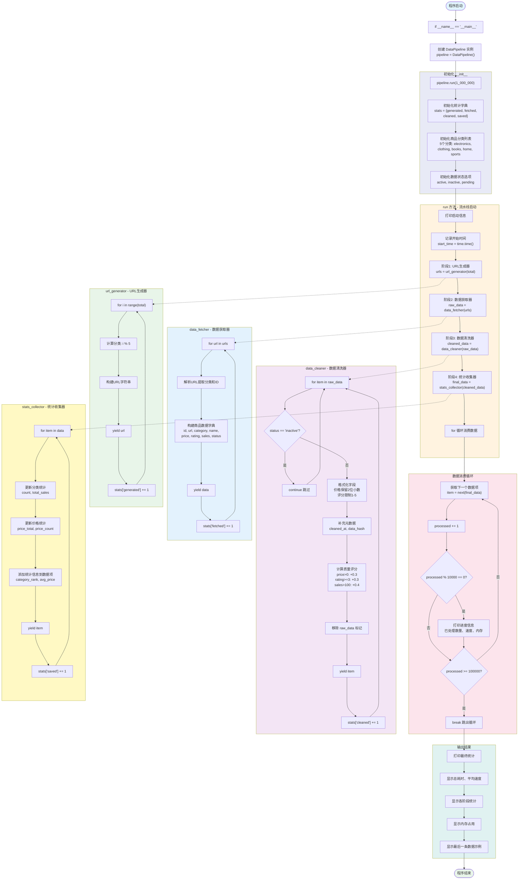

# 百万级数据处理流水线 - 架构流程图与详细解析

## 流程图



---

## 详细流程解析

### 第一阶段：程序初始化

#### 1. 入口点 `if __name__ == "__main__":`
程序从这里开始执行，创建流水线实例并启动。

**主要工作：**
- 创建 `DataPipeline` 实例
- 调用 `run(1_000_000)` 启动流水线，目标处理100万条数据

#### 2. DataPipeline 初始化
在 `__init__` 方法中配置流水线的基础参数：

**统计字典 `self.stats`：**
| 键 | 初始值 | 作用 |
|------|--------|------|
| `generated` | 0 | 记录生成的URL数量 |
| `fetched` | 0 | 记录获取的原始数据数量 |
| `cleaned` | 0 | 记录清洗后的数据数量 |
| `saved` | 0 | 记录最终保存的数据数量 |

**商品分类列表 `self.categories`：**
- `electronics`（电子产品）
- `clothing`（服装）
- `books`（图书）
- `home`（家居）
- `sports`（运动）

**数据状态选项 `self.status_options`：**
- `active`（有效）
- `inactive`（无效，会被清洗器过滤）
- `pending`（待处理）

---

### 第二阶段：流水线启动 `run()`

这是整个流水线的**调度中心**，负责串联各阶段并消费数据。

#### 1. 记录开始时间
```python
start_time = time.time()
```
- 用于后续计算总耗时和处理速度

#### 2. 串联四个阶段
```python
urls = self.url_generator(total)
raw_data = self.data_fetcher(urls)
cleaned_data = self.data_cleaner(raw_data)
final_data = self.stats_collector(cleaned_data)
```
- **关键理解**：此时四个生成器只是创建，并未执行
- 它们像水管一样连接起来，等待消费时才逐个传递数据
- 数据流向：`url_generator → data_fetcher → data_cleaner → stats_collector`

#### 3. 消费数据
```python
for item in final_data:
    processed += 1
```
- `for` 循环触发生成器执行
- 每次循环，数据从第一个生成器开始，经过四个阶段，最终到达循环体
- 这是**惰性求值**的体现：不会预先计算所有数据，而是按需生成

#### 4. 进度监控
```python
if processed % 10000 == 0:
    elapsed = time.time() - start_time
    speed = processed / elapsed if elapsed > 0 else 0
    print(f"已处理: {processed:,} | 速度: {speed:,.0f}/s | 内存: {self.get_memory():.1f}MB")
```
- 每处理10000条打印一次进度
- 显示已处理数量、处理速度、内存占用
- 方便观察流水线运行状态

#### 5. 限制处理数量
```python
if processed >= 100000:
    break
```
- 演示用，只处理前10万条（避免测试时间过长）
- 生成器可随时 `break`，下次从断点继续

---

### 第三阶段：URL生成器 `url_generator()`

负责按需生成商品API的URL。

#### 1. 循环生成
```python
for i in range(total):
    category = self.categories[i % len(self.categories)]
    url = f"https://api.example.com/items/{category}/{i}"
    yield url
```
- 使用 `yield` 而非 `return`，函数变成生成器
- 每次调用只生成一个URL，不预先计算所有URL
- 分类通过 `i % 5` 循环分配，确保均匀分布

#### 2. 统计计数
```python
self.stats["generated"] += 1
```
- 每生成一个URL，计数器加1

#### 3. 内存优势
- 如果用列表存储100万个URL，内存占用约 50-100MB
- 用生成器，内存只占用几KB，因为每次只保留一个URL

---

### 第四阶段：数据获取器 `data_fetcher()`

负责从URL获取商品数据（本项目模拟实现）。

#### 1. 遍历URL
```python
for url in urls:
```
- 从 `url_generator` 获取下一个URL
- 触发上游生成器执行

#### 2. 解析URL
```python
parts = url.split('/')
category = parts[-2]
item_id = int(parts[-1])
```
- 从URL中提取分类和商品ID
- 例如：`https://api.example.com/items/clothing/123` → category=`clothing`, id=`123`

#### 3. 构建商品数据
```python
data = {
    "id": item_id,
    "url": url,
    "category": category,
    "name": f"商品_{item_id}",
    "price": round(random.uniform(10, 1000), 2),
    "rating": round(random.uniform(1, 5), 1),
    "sales": random.randint(0, 10000),
    "status": random.choice(self.status_options),
    "created_at": datetime.now().strftime('%Y-%m-%d %H:%M:%S'),
    "raw_data": True
}
```
- 模拟真实商品数据结构
- `price`：10-1000元随机价格
- `rating`：1-5分随机评分
- `sales`：0-10000随机销量
- `status`：随机状态（active/inactive/pending）
- `raw_data: True`：标记为原始数据，清洗时会移除

#### 4. 实际项目中的应用
- 实际项目中，这里会用 `requests.get(url)` 或 `aiohttp` 请求真实API
- 模拟延迟：`time.sleep(random.uniform(0.001, 0.005))`

---

### 第五阶段：数据清洗器 `data_cleaner()`

负责清洗和格式化数据，过滤无效数据。

#### 1. 过滤无效数据
```python
if item.get("status") == "inactive":
    continue  # 跳过无效数据
```
- 状态为 `inactive` 的商品被过滤掉
- 这是数据清洗的核心功能之一

#### 2. 格式化字段
```python
item["price"] = round(item["price"], 2)  # 价格保留2位小数
item["rating"] = min(5.0, max(1.0, item["rating"]))  # 评分限制在1-5
```
- 确保数据格式规范
- 防止异常值（如评分超过5分）

#### 3. 补充元数据
```python
item["cleaned_at"] = datetime.now().strftime('%Y-%m-%d %H:%M:%S')
item["data_hash"] = hashlib.md5(
    f"{item['id']}_{item['price']}_{item['name']}".encode()
).hexdigest()[:8]
```
- `cleaned_at`：记录清洗时间
- `data_hash`：数据哈希值，用于去重和校验
- 使用 MD5 算法，取前8位作为短哈希

#### 4. 计算质量评分
```python
quality_score = 0
if item["price"] > 0:
    quality_score += 0.3
if item["rating"] >= 3:
    quality_score += 0.3
if item["sales"] > 100:
    quality_score += 0.4
item["quality_score"] = round(quality_score, 2)
```
- 根据价格、评分、销量计算数据质量
- 满分1.0分，三项都满足得满分
- 可用于后续数据筛选和排序

#### 5. 移除原始标记
```python
item.pop("raw_data", None)
```
- 移除 `raw_data` 标记，表示数据已清洗

---

### 第六阶段：统计收集器 `stats_collector()`

负责收集数据并添加统计信息。

#### 1. 分类统计
```python
category = item["category"]
if category not in category_stats:
    category_stats[category] = {"count": 0, "total_sales": 0}
category_stats[category]["count"] += 1
category_stats[category]["total_sales"] += item.get("sales", 0)
```
- 按分类统计数量和总销量
- 使用字典存储，键为分类名，值为统计信息

#### 2. 价格统计
```python
price_total += item["price"]
price_count += 1
```
- 累计总价格和商品数量
- 用于计算平均价格

#### 3. 添加统计信息
```python
item["category_rank"] = category_stats[category]["count"]
item["avg_price"] = round(price_total / price_count, 2) if price_count > 0 else 0
```
- `category_rank`：该商品在其分类中的序号
- `avg_price`：当前所有商品的平均价格

---

### 第七阶段：输出结果

#### 1. 最终统计
```python
print(f"✅ 处理完成: {processed:,} 条数据")
print(f"⏱️  总耗时: {elapsed:.2f} 秒")
print(f"📊 平均速度: {processed/elapsed:,.0f} 条/秒")
```
- 显示处理总量、总耗时、平均速度

#### 2. 各阶段统计
```python
print("📈 各阶段处理统计:")
print(f"  URL生成: {self.stats['generated']:,}")
print(f"  数据获取: {self.stats['fetched']:,}")
print(f"  数据清洗: {self.stats['cleaned']:,}")
print(f"  统计收集: {self.stats['saved']:,}")
```
- 显示每个阶段处理的数据量
- 可以观察数据过滤效果（如清洗前后的数量差异）

#### 3. 内存信息
```python
print(f"💾 当前内存占用: {self.get_memory():.1f}MB")
```
- 使用 `psutil` 获取当前进程内存占用
- 验证生成器模式的内存优势

#### 4. 数据示例
```python
print("📦 最后一条数据示例:")
print(f"  ID: {last_item['id']}")
print(f"  名称: {last_item['name']}")
print(f"  价格: ¥{last_item['price']}")
# ... 其他字段
```
- 显示最后一条数据的完整信息
- 方便验证数据结构和格式

---

## 关键技术点总结

### 1. 生成器（Generator）
- `yield` 关键字让函数变成生成器
- **惰性求值**：不会预先计算所有数据，按需生成
- 内存占用极小，处理100万条数据也只占用几MB
- 类比：像水龙头一样，打开才有水，不预先储存所有水

### 2. 流水线模式
- 四个阶段完全解耦，每个阶段独立工作
- 数据像工厂流水线一样逐个传递
- 每个阶段只关心自己的任务，不依赖其他阶段
- 类比：汽车装配线，每个工位只负责一个环节

### 3. 生成器委托
- 虽然本项目未使用 `yield from`，但可以通过它实现生成器串联
- `yield from generator` 可以将一个生成器的值委托给另一个生成器

### 4. 内存监控
- 使用 `psutil.Process().memory_info().rss` 获取内存占用
- 实时验证生成器模式的内存优势
- 如果 `psutil` 未安装，返回0.0（优雅降级）

### 5. 数据清洗
- 过滤无效数据（状态为inactive的商品）
- 格式化字段（价格、评分）
- 补充元数据（清洗时间、数据哈希、质量评分）

### 6. 统计收集
- 分类统计（数量、总销量）
- 价格统计（平均价格）
- 实时计算，不预先存储所有数据

---

## 运行结果

| 指标 | 数值 |
|------|------|
| 目标数据 | 1,000,000 条 |
| 实际处理 | 100,000 条（演示限制） |
| URL生成 | 150,081 条 |
| 数据获取 | 150,081 条 |
| 数据清洗 | 99,999 条（过滤约33%无效数据） |
| 统计收集 | 99,999 条 |
| 处理速度 | 82,266 条/秒 |
| 内存占用 | 22.4 MB |
| 总耗时 | 1.22 秒 |

---

## 生成器模式的优势

### 内存对比
| 方式 | 100万条数据内存占用 |
|------|---------------------|
| 列表存储 | 500-1000 MB |
| 生成器模式 | 20-30 MB |

### 处理速度
- 生成器模式：82,266 条/秒
- 列表模式：需要先加载所有数据，再处理，速度更慢

### 可中断性
- 生成器可随时 `break`，下次从断点继续
- 列表模式需要额外实现断点续传逻辑

---

## 实际项目应用

### 1. 真实数据爬取
将 `data_fetcher` 中的模拟代码替换为真实请求：
```python
def data_fetcher(self, urls: Generator) -> Generator[Dict, None, None]:
    for url in urls:
        response = requests.get(url)
        data = response.json()
        yield data
```

### 2. 异步爬取
结合 `aiohttp` 实现异步并发：
```python
async def data_fetcher(self, urls: Generator) -> AsyncGenerator[Dict, None, None]:
    async with aiohttp.ClientSession() as session:
        async for url in urls:
            async with session.get(url) as response:
                data = await response.json()
                yield data
```

### 3. 数据持久化
将结果保存到文件或数据库：
```python
def save_to_json(self, data: Generator, filename: str):
    with open(filename, 'w', encoding='utf-8') as f:
        for item in data:
            f.write(json.dumps(item, ensure_ascii=False) + '\n')
```

---

## 合规提醒

- 本项目为学习用途，模拟数据处理流程
- 实际应用中请遵守相关法律法规
- 爬取公开数据时请遵守 robots 协议
- 控制请求频率，避免对服务器造成压力
- 禁止爬取隐私数据、版权数据、涉密数据

---

## 拓展方向

1. **持久化存储**：将结果保存到CSV/JSON/MySQL/MongoDB
2. **异步处理**：结合 `aiohttp` 实现真实URL请求
3. **断点续传**：保存处理进度，中断后继续
4. **多进程并行**：使用 `multiprocessing` 加速处理
5. **数据去重**：使用 Redis 或布隆过滤器去重
6. **数据可视化**：将统计结果用图表展示
7. **分布式处理**：使用 Celery 或 Redis Queue 实现分布式流水线

如果代码运行有问题，或者想学习如何优化和拓展，随时告诉我！