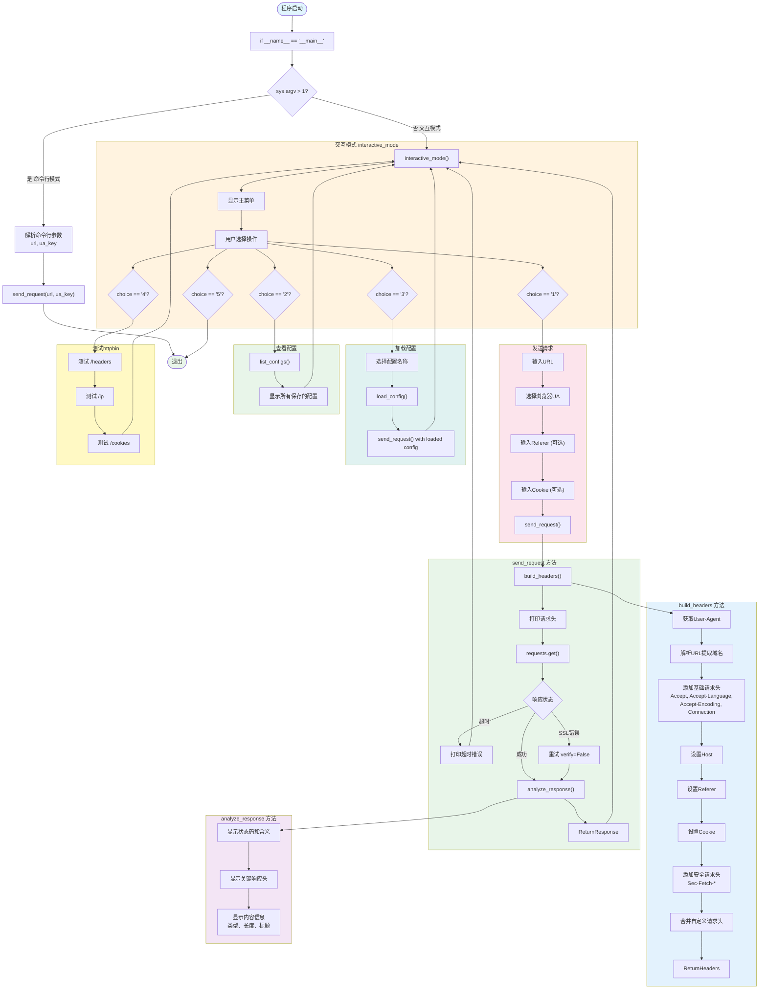

# HTTP请求头构造器 - 架构流程图与详细解析

## 流程图



---

## 详细流程解析

### 第一阶段：程序入口

#### 1. 主函数入口
```python
if __name__ == "__main__":
    builder = HeaderBuilder()
    if len(sys.argv) > 1:
        builder.send_request(url, ua_key)
    else:
        builder.interactive_mode()
```

**两种运行模式：**
- **命令行模式**：直接传入URL和UA类型
  ```bash
  python projectA.py https://httpbin.org/headers chrome
  ```
- **交互式模式**：显示菜单，用户逐步选择

#### 2. HeaderBuilder 初始化
```python
def __init__(self):
    self.config_dir = 'header_configs'
    if not os.path.exists(self.config_dir):
        os.makedirs(self.config_dir)
```
- 创建配置保存目录
- 用于存储常用的请求头配置

---

### 第二阶段：请求头构造 `build_headers()`

这是核心方法，构造完整的浏览器请求头。

#### 1. 获取User-Agent
```python
ua_info = self.USER_AGENTS.get(ua_key, self.USER_AGENTS['chrome'])
headers = {'User-Agent': ua_info['ua']}
```
- 支持8种浏览器UA：Chrome、Firefox、Safari、Edge等
- 不同UA会返回不同版本的页面

**支持的UA列表：**
| 键名 | 名称 | 场景 |
|------|------|------|
| chrome | Chrome (Windows) | 桌面浏览器 |
| chrome_mac | Chrome (macOS) | macOS浏览器 |
| firefox | Firefox (Windows) | Firefox用户 |
| firefox_mac | Firefox (macOS) | macOS Firefox |
| safari | Safari (macOS) | Safari用户 |
| edge | Edge (Windows) | Edge用户 |
| mobile_chrome | Chrome (Android) | 安卓手机 |
| mobile_safari | Safari (iPhone) | iPhone |

#### 2. 解析URL
```python
parsed = urlparse(url)
```
- 提取协议、域名、路径等信息
- 用于设置Host和Referer

#### 3. 添加基础请求头
```python
headers['Accept'] = 'text/html,application/xhtml+xml,application/xml;q=0.9,...'
headers['Accept-Language'] = 'zh-CN,zh;q=0.9,en;q=0.8'
headers['Accept-Encoding'] = 'gzip, deflate, br'
headers['Connection'] = 'keep-alive'
headers['Upgrade-Insecure-Requests'] = '1'
```
- **Accept**：告诉服务器能处理的内容类型
- **Accept-Language**：声明语言偏好
- **Accept-Encoding**：支持压缩，节省流量
- **Connection**：保持连接复用
- **Upgrade-Insecure-Requests**：支持HTTPS升级

#### 4. 设置Host和Referer
```python
headers['Host'] = parsed.netloc  # 例如: httpbin.org

if referer:
    headers['Referer'] = referer
else:
    headers['Referer'] = f'{parsed.scheme}://{parsed.netloc}/'
```
- **Host**：必填，告诉服务器目标域名
- **Referer**：防盗链必备，让服务器知道从哪个页面来

#### 5. 设置Cookie
```python
if cookies:
    headers['Cookie'] = cookies
```
- 用于传递登录态等会话信息

#### 6. 添加安全请求头
```python
headers['Sec-Fetch-Dest'] = 'document'
headers['Sec-Fetch-Mode'] = 'navigate'
headers['Sec-Fetch-Site'] = 'none'
headers['Sec-Fetch-User'] = '?1'
```
- 现代浏览器的安全特性
- 防止CSRF攻击和请求伪造

---

### 第三阶段：发送请求 `send_request()`

#### 1. 打印请求头
```python
print("\n" + "=" * 50)
print("发送的请求头")
print("=" * 50)
for key, value in headers.items():
    print(f"{key}: {value}")
```
- 发送前显示所有请求头，方便验证

#### 2. 发送请求
```python
response = requests.get(url, headers=headers, timeout=15, verify=True)
```
- 使用构造好的请求头发送GET请求
- 设置15秒超时
- SSL证书验证默认开启

#### 3. 异常处理
```python
except requests.exceptions.Timeout:
    print("❌ 请求超时（15秒）")

except requests.exceptions.SSLVerificationError:
    print("⚠️ SSL证书验证失败，尝试忽略...")
    response = requests.get(url, headers=headers, timeout=15, verify=False)
```
- 超时处理
- SSL错误时自动降级（部分网站证书问题）

---

### 第四阶段：响应分析 `analyze_response()`

#### 1. 状态码解释
```python
status_info = {
    200: 'OK - 请求成功',
    301: 'Moved Permanently - 永久重定向',
    302: 'Found - 临时重定向',
    400: 'Bad Request - 请求错误',
    401: 'Unauthorized - 未授权',
    403: 'Forbidden - 禁止访问',
    404: 'Not Found - 页面不存在',
    429: 'Too Many Requests - 请求过于频繁',
    500: 'Internal Server Error - 服务器错误',
    ...
}
```
- 将状态码转换为可读的解释

#### 2. 关键响应头
```python
for key, value in response.headers.items():
    if key.lower() in ['content-type', 'content-length', 'date', 'server', 'set-cookie']:
        print(f"  {key}: {value}")
```
- 只显示重要的响应头

#### 3. 内容分析
```python
if 'text/html' in content_type:
    print(f"内容类型: HTML页面")
    print(f"内容长度: {len(response.text)} 字符")
    # 提取title
    if '<title>' in response.text:
        title = response.text[...]

elif 'application/json' in content_type:
    print(f"内容类型: JSON数据")
    data = response.json()
```
- HTML页面：提取标题
- JSON数据：格式化显示

---

### 第五阶段：交互模式 `interactive_mode()`

#### 主菜单
```
支持的浏览器UA:
  chrome: Chrome (Windows)
  chrome_mac: Chrome (macOS)
  firefox: Firefox (Windows)
  ...

请选择操作:
  1. 发送请求（输入URL）
  2. 查看保存的配置
  3. 加载配置发送请求
  4. 测试 httpbin.org
  5. 退出
```

**选项1 - 发送请求：**
1. 输入目标URL
2. 选择浏览器UA
3. 输入可选的Referer和Cookie
4. 发送请求并显示结果
5. 询问是否保存配置

**选项2 - 查看配置：**
- 列出所有保存的请求头配置

**选项3 - 加载配置：**
- 根据名称加载已有配置
- 使用加载的配置发送请求

**选项4 - 测试httpbin：**
- `/headers`：查看发送的请求头
- `/ip`：查看请求来源IP
- `/cookies`：查看Cookie状态

---

### 第六阶段：配置管理

#### 保存配置
```python
def save_config(self, name: str, url: str, ua_key: str, headers: Dict):
    config_file = os.path.join(self.config_dir, f'{name}.json')
    config = {'name': name, 'url': url, 'ua_key': ua_key, 'headers': headers}
    with open(config_file, 'w', encoding='utf-8') as f:
        json.dump(config, f, indent=2, ensure_ascii=False)
```
- 保存到 `header_configs/{name}.json`

#### 加载配置
```python
def load_config(self, name: str) -> Optional[Dict]:
    config_file = os.path.join(self.config_dir, f'{name}.json')
    if os.path.exists(config_file):
        with open(config_file, 'r', encoding='utf-8') as f:
            return json.load(f)
    return None
```

---

## 请求头完全指南

| 请求头 | 作用 | 示例值 |
|--------|------|--------|
| User-Agent | 浏览器标识 | Mozilla/5.0 (Windows NT 10.0; Win64; x64) AppleWebKit/537.36... |
| Accept | 能处理的内容类型 | text/html,application/xhtml+xml,application/xml;q=0.9,*/* |
| Accept-Language | 语言偏好 | zh-CN,zh;q=0.9,en;q=0.8 |
| Accept-Encoding | 支持的压缩算法 | gzip, deflate, br |
| Connection | 连接管理 | keep-alive |
| Upgrade-Insecure-Requests | 支持HTTPS升级 | 1 |
| Host | 目标主机 | httpbin.org |
| Referer | 来源页面 | https://httpbin.org/ |
| Cookie | 会话Cookie | session_id=abc123 |
| Sec-Fetch-Dest | 资源类型 | document |
| Sec-Fetch-Mode | 请求模式 | navigate |
| Sec-Fetch-Site | 来源站点关系 | none |
| Sec-Fetch-User | 用户触发的请求 | ?1 |

---

## 运行结果

### httpbin.org/headers 测试
```bash
$ python projectA.py https://httpbin.org/headers chrome
```

**发送的请求头：**
```
User-Agent: Mozilla/5.0 (Windows NT 10.0; Win64; x64) AppleWebKit/537.36...
Accept: text/html,application/xhtml+xml,application/xml;q=0.9,...
Accept-Language: zh-CN,zh;q=0.9,en;q=0.8
Accept-Encoding: gzip, deflate, br
Connection: keep-alive
Upgrade-Insecure-Requests: 1
Host: httpbin.org
Referer: https://httpbin.org/
Sec-Fetch-Dest: document
Sec-Fetch-Mode: navigate
Sec-Fetch-Site: none
Sec-Fetch-User: ?1
```

**响应结果：**
```
状态码: 200 - OK - 请求成功
响应头:
  Date: Tue, 28 Apr 2026 06:05:47 GMT
  Content-Type: application/json
  Content-Length: 710

内容类型: JSON数据
JSON数据: {
  "headers": {
    "Accept": "text/html,application/xhtml+xml,...",
    "Accept-Language": "zh-CN,zh;q=0.9,en;q=0.8",
    ...
  }
}
```

---

## 验收标准达成

| 标准 | 状态 | 说明 |
|------|------|------|
| 请求头完整 | ✅ | 包含14个请求头字段 |
| User-Agent | ✅ | 支持8种浏览器UA切换 |
| Referer | ✅ | 自动设置防盗链来源 |
| Accept-Encoding | ✅ | 支持gzip/deflate/br压缩 |
| Cookie处理 | ✅ | 支持手动设置Cookie |

---

## 加分项达成

- [x] 支持选择不同的User-Agent（Chrome/Firefox/Safari/Edge/移动端）
- [x] 支持查看每个请求头的作用说明（explain_headers方法）
- [x] 支持保存常用网站的请求头配置（save_config/load_config）

---

## 合规提醒

- 本项目为学习用途，用于理解HTTP协议和请求头构造
- 实际爬虫应用请遵守：
  - robots协议
  - 网站的使用条款
  - 相关法律法规
- 禁止：
  - 高频请求攻击服务器
  - 爬取隐私数据、版权数据
  - 绕过网站的反爬措施

---

## 拓展方向

1. **自动检测网站需求**：分析网站自动确定需要的请求头
2. **请求头模板**：为不同类型网站保存模板
3. **性能对比**：对比不同UA的响应速度和内容差异
4. **请求历史**：记录每次请求的请求头和响应
5. **集成浏览器工具**：结合Selenium获取真实浏览器的请求头