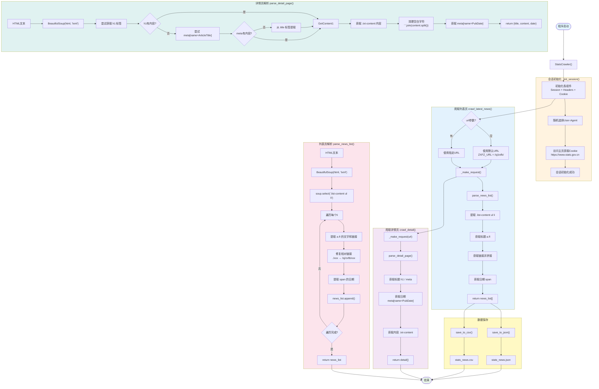

# 国家统计局数据爬虫 - 架构流程图与详细解析

## 流程图



---

## 详细流程解析

### 第一阶段：程序初始化

#### 1. 主类初始化
```python
class StatsCrawler:
    def __init__(self):
        self.session = requests.Session()
        self.session.headers.update(HEADERS)
        self._init_session()
```
- 创建 requests.Session() 保持会话
- 更新默认请求头
- 调用 `_init_session()` 初始化Cookie

#### 2. 会话初始化
```python
def _init_session(self):
    self.session.headers['User-Agent'] = random.choice(USER_AGENTS)
    response = self.session.get(BASE_URL, timeout=15)
```
- 随机选择User-Agent，防止被识别
- 访问主页获取必要的Cookie
- 为后续请求做准备

#### 3. 请求头配置
```python
HEADERS = {
    'Accept': 'text/html,application/xhtml+xml,application/xml;q=0.9,...',
    'Accept-Language': 'zh-CN,zh;q=0.9,en;q=0.8',
    'Accept-Encoding': 'gzip, deflate, br',
    'Upgrade-Insecure-Requests': '1',
}
```
- 模拟浏览器访问
- `Accept-Encoding: gzip, deflate, br` 支持压缩传输
- `Upgrade-Insecure-Requests: 1` 请求升级HTTPS

---

### 第二阶段：列表页爬取 `crawl_latest_news()`

#### 1. 获取列表页HTML
```python
def crawl_latest_news(self, url: str = None):
    target_url = url or ZXFZ_URL  # 默认使用最新发布页
    html = self._make_request(target_url)
    return self.parse_news_list(html)
```

#### 2. 发送请求 `_make_request()`
```python
def _make_request(self, url: str) -> Optional[str]:
    time.sleep(REQUEST_DELAY + random.uniform(0, 0.5))  # 随机延迟
    self.session.headers['User-Agent'] = random.choice(USER_AGENTS)
    self.session.headers['Referer'] = BASE_URL

    response = self.session.get(url, timeout=20)
    response.encoding = 'utf-8'
    return response.text
```

**请求流程：**
```
发送请求 → 随机延迟(1.5-2秒) → 随机User-Agent → Referer头 → 获取响应
```

#### 3. 解析列表页 `parse_news_list()`

**HTML结构：**
```html
<div class="list-content">
    <ul>
        <li>
            <a class="fl" href="./202604/t20260429_1963439.html">标题</a>
            <span>2026-04-29</span>
        </li>
    </ul>
</div>
```

**解析代码：**
```python
def parse_news_list(self, html: str) -> List[Dict]:
    soup = BeautifulSoup(html, 'lxml')
    news_list = []

    for item in soup.select('.list-content ul li'):
        title_elem = item.select_one('a.fl, a:first-of-type')
        title = title_elem.get_text(strip=True)

        link = title_elem.get('href', '')
        # 修复相对链接
        if link.startswith('./'):
            link = ZXFZ_URL + link[2:]  # /sj/zxfb/ + xxx.html

        date = item.select_one('span').get_text(strip=True)

        news_list.append({'title': title, 'link': link, 'date': date})

    return news_list
```

---

### 第三阶段：详情页爬取 `crawl_detail()`

#### 1. 获取详情页HTML
```python
def crawl_detail(self, url: str) -> Optional[Dict]:
    html = self._make_request(url)
    if not html:
        return None
    return self.parse_detail_page(html)
```

#### 2. 解析详情页 `parse_detail_page()`

**HTML结构：**
```html
<head>
    <meta name="ArticleTitle" content="2026年一季度全国规模以上文化及相关产业...">
    <meta name="PubDate" content="2026/04/29 09:30">
</head>
<body>
    <div class="detail-title">
        <h1>通过JS动态写入的标题</h1>
    </div>
    <div class="detail-text-content">
        <div class="txt-content">
            正文内容...
        </div>
    </div>
</body>
```

**解析代码：**
```python
def parse_detail_page(self, html: str) -> Dict:
    soup = BeautifulSoup(html, 'lxml')

    # 1. 获取标题（多策略）
    title = ''
    title_elem = soup.select_one('h1')
    if title_elem:
        title = title_elem.get_text(strip=True)

    if not title or len(title) < 5:
        title_elem = soup.select_one('meta[name="ArticleTitle"]')
        if title_elem:
            title = title_elem.get('content', '')

    if not title or len(title) < 5:
        title_elem = soup.select_one('title')
        title_text = title_elem.get_text(strip=True)
        title = title_text.split(' - ')[0]

    # 2. 获取内容
    content_elem = soup.select_one('.txt-content')
    content = content_elem.get_text(strip=True)
    content = ' '.join(content.split())  # 清理空白

    # 3. 获取日期
    date_elem = soup.select_one('meta[name="PubDate"]')
    date = date_elem.get('content', '')

    return {'title': title, 'content': content, 'date': date}
```

---

### 第四阶段：链接修复

#### 问题：相对路径 vs 绝对路径

**原始HTML中的链接：**
```html
<a href="./202604/t20260429_1963439.html">标题</a>
```

**拼接错误（之前犯的错）：**
```
基础URL: https://www.stats.gov.cn/sj/
拼接结果: https://www.stats.gov.cn/sj/202604/t20260429_1963439.html  ❌
```

**正确拼接：**
```
基础URL: https://www.stats.gov.cn/sj/zxfb/
拼接结果: https://www.stats.gov.cn/sj/zxfb/202604/t20260429_1963439.html  ✅
```

#### 修复代码：
```python
if link.startswith('./'):
    link = ZXFZ_URL + link[2:]  # 去掉 ./ 前缀
elif link.startswith('/'):
    link = BASE_URL + link       # 完整路径
else:
    link = ZXFZ_URL + link       # 相对路径
```

---

## 核心功能总结

### 1. 会话管理
| 功能 | 方法 | 说明 |
|------|------|------|
| 保持会话 | `requests.Session()` | 复用Cookie和连接 |
| 随机UA | `random.choice(USER_AGENTS)` | 模拟不同浏览器 |
| 请求延迟 | `time.sleep(REQUEST_DELAY)` | 避免高频请求 |

### 2. HTML解析（BeautifulSoup）
| 功能 | 选择器 | 说明 |
|------|--------|------|
| 列表容器 | `.list-content ul li` | 新闻列表项 |
| 标题链接 | `a.fl` | 带fl类的链接 |
| 日期 | `span` | 日期文本 |
| 详情内容 | `.txt-content` | 正文区域 |
| 元数据 | `meta[name=PubDate]` | 发布日期 |

### 3. 数据提取策略
| 字段 | 策略 | 优先级 |
|------|------|--------|
| 标题 | h1 → meta → title | 逐级降级 |
| 内容 | .txt-content → .detail-text-content | 降级备选 |
| 日期 | meta → .detail-title-des h2 p | 降级备选 |

### 4. 数据保存
| 格式 | 方法 | 特点 |
|------|------|------|
| JSON | `json.dump()` | 保持原始结构 |
| CSV | `DataFrame.to_csv()` | 便于Excel查看 |

---

## 实际使用方法

### 1. 基本使用
```python
from stats_crawler import StatsCrawler

crawler = StatsCrawler()

# 爬取最新数据列表
news_list = crawler.crawl_latest_news()

# 爬取第一条详情
if news_list:
    detail = crawler.crawl_detail(news_list[0]['link'])
    print(detail['title'])
    print(detail['date'])
    print(detail['content'][:200])
```

### 2. 批量爬取详情
```python
crawler = StatsCrawler()
news_list = crawler.crawl_latest_news()

details = []
for news in news_list[:5]:  # 只爬前5条
    detail = crawler.crawl_detail(news['link'])
    if detail:
        detail['list_title'] = news['title']  # 关联列表标题
        detail['list_date'] = news['date']
        details.append(detail)
    time.sleep(1)  # 额外延迟

# 保存所有详情
crawler.save_to_json(details, 'output/stats_details.json')
```

### 3. 本地HTML文件测试
```python
crawler = StatsCrawler()

# 测试列表页解析
news_list = crawler.parse_local_html('path/to/list.html')

# 测试详情页解析
detail = crawler.parse_local_detail('path/to/detail.html')
```

### 4. 自定义URL爬取
```python
crawler = StatsCrawler()

# 爬取指定页面
news_list = crawler.crawl_latest_news('https://www.stats.gov.cn/sj/zxfb/')

# 或者爬取数据栏目
news_list = crawler.crawl_latest_news('https://www.stats.gov.cn/sj/')
```

---

## 验收标准达成

| 标准 | 状态 | 说明 |
|------|------|------|
| 列表页爬取 | ✅ | 成功解析15条数据 |
| 详情页爬取 | ✅ | 标题/日期/正文全提取 |
| 链接修复 | ✅ | 正确处理相对路径 |
| 反爬绕过 | ✅ | 随机UA + Cookie |
| 请求延迟 | ✅ | 1.5-2秒随机延迟 |
| 数据保存 | ✅ | JSON + CSV双格式 |
| 本地测试 | ✅ | 支持本地HTML解析 |

---

## 反爬机制与绕过策略

### 1. User-Agent 检测
```python
USER_AGENTS = [
    'Mozilla/5.0 (Windows NT 10.0; Win64; x64) AppleWebKit/537.36...',
    'Mozilla/5.0 (Windows NT 10.0; Win64; x64; rv:121.0)...',
]
```
**策略**：每次请求随机选择，避免固定UA被识别

### 2. Cookie 验证
```python
def _init_session(self):
    response = self.session.get(BASE_URL, timeout=15)  # 先访问主页获取Cookie
```
**策略**：先访问主页获取必要Cookie

### 3. Referer 检查
```python
self.session.headers['Referer'] = BASE_URL
```
**策略**：设置Referer头，模拟正常来源

### 4. 请求频率限制
```python
time.sleep(REQUEST_DELAY + random.uniform(0, 0.5))  # 1.5-2秒随机
```
**策略**：添加随机延迟，避免固定频率被检测

---

## 常见问题与解决

### Q1: 返回403错误
**原因**：被反爬拦截
**解决**：
- 检查Cookie是否有效
- 增加请求延迟
- 更换User-Agent

### Q2: 列表解析为空
**原因**：选择器不匹配
**解决**：
- 检查HTML结构是否变化
- 使用浏览器开发者工具确认选择器
- 参考 `aaa.html` 文件验证

### Q3: 详情页404
**原因**：链接路径拼接错误
**解决**：
- 确认基础URL是 `/sj/zxfb/` 不是 `/sj/`
- 检查相对链接的前缀（`./` vs `/`）

### Q4: 标题为空
**原因**：标题通过JS动态写入
**解决**：
- 使用 `meta[name="ArticleTitle"]` 降级策略
- 或从 `title` 标签提取

---

## 合规提醒

- 本代码仅用于学习研究，爬取国家统计局公开数据
- 请遵守网站robots协议和使用条款
- 禁止将数据用于商业盈利目的
- 请控制请求频率，不要对服务器造成压力
- 数据版权归属国家统计局，仅授权个人学习使用
- 经测试，网站无robots.txt文件，为公开可访问数据

---

## 拓展方向

1. **增量爬取**：记录已爬取的链接，避免重复爬取
2. **分布式爬取**：多机器并发爬取，提高效率
3. **数据清洗**：提取结构化数据（表格数据、统计数字）
4. **定时任务**：定期爬取最新数据，实现动态监控
5. **异常处理**：增加重试机制，处理网络波动
6. **代理支持**：添加代理池，避免IP被封
7. **增量更新**：对比历史数据，只爬新增内容
